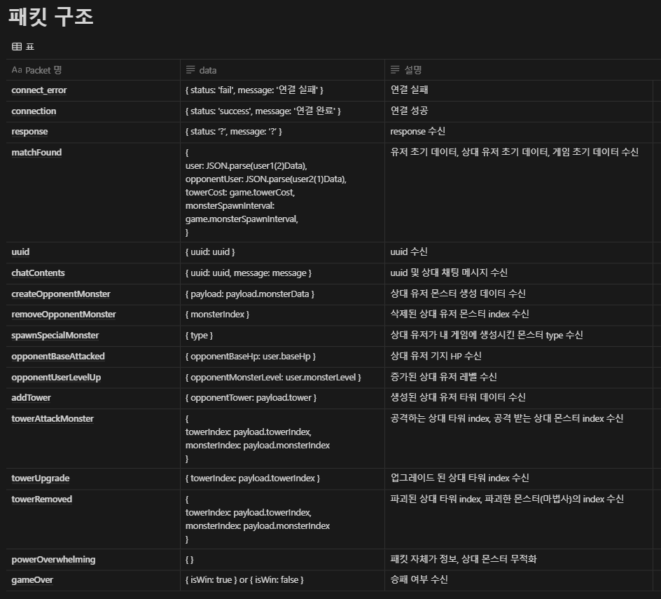
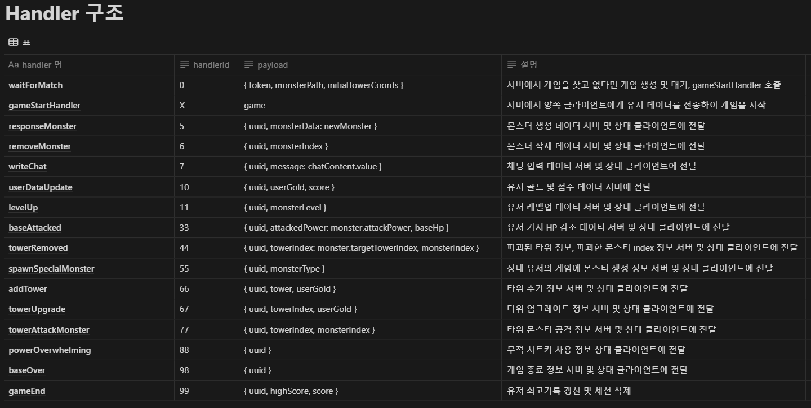
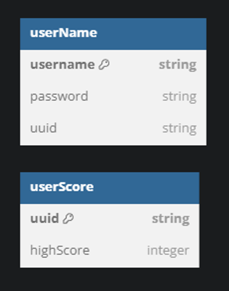

# tower-defense-game

### 게임 설명

- 회원가입/ 로그인후 게임을 시작한다.

- 몰려오는 몬스터를 타워를 배치하여서 막는 게임이다.

- pvp 게임으로 1 vs 1로 사용자 2명이서 게임이 진행된다.

- 유저는 화면이 가로로 2분할 된 인터페이스를 제공받는다.

- 위에서 진행되는 것이 유저의 진영이며 아래는 상대편의 진영이다.

- 골드로 상대편 진영에 몬스터를 생성할 수 있다.

- 레벨을 올려 상대 진영에 생성되는 몬스터의 스탯을 올릴 수 있다.

- 한 쪽 유저의 기지 HP가 0 이하로 떨어지면 게임이 종료된다.

### AWS 배포 링크

- [tower-defense-game](http://52.78.192.41:5500)

### 기능

- 회원가입/로그인

  - 회원가입 페이지에서 Id와 비밀번호 입력
  - 데이터 베이스에 고유 uuid와 최고 점수 0점 저장 됨
  - 로그인 시 고유 uuid 쿠키 생성

- 매칭 기능

  - 유저가 매칭을 시작할 시, 게임 방을 찾으며 없을 경우 방을 생성
  - 방이 있을 경우 해당 게임에 참가 후 서버에서 두 유저에게 게임 시작 패킷을 전송

- 동기화 기능

  - 몬스터 생성, 타워 추가 등은 생성 시에 몬스터와 타워 정보 패킷을 서버에게 보냄
  - 서버가 받은 패킷은 검증을 거쳐 상대방 클라이언트에 보내 두 플레이어 간 동기화가 이뤄짐

- 타워 구입 기능

  - 타워 구매시 골드 차감
  - 이후 몬스터 이동 경로 근처에 랜덤으로 생성
  - 최대 10개 까지 배치 가능

- 몬스터 처치 기능

  - 타워로 몬스터 공격후 hp가 0이하시 처치
  - 처치 후 골드와 점수 획득

- 채팅 기능

  - 상대방과 실시간으로 채팅으로 대화할 수 있음
  - 골드가 부족하거나 타워 제한이 걸릴 때 system 에서 채팅창으로 메시지를 보내줌
  - 골드 획득, 기지와 몬스터 무적화 등 치트키가 숨어있음

- 타워 업그레이드 기능

  - 현재 보유한 타워 중 랜덤으로 하나를 업그레이드 시킴

  - 타워 업그레이드시 골드 차감

  - 업그레이드 할 때마다 이미지와 공격력 상승, 6단계까지 가능

- 3가지의 몬스터 생성 기능

  - 전갈은 빠른 이동속도를 가지고 있으며, 체력이 낮음

  - 마법사는 몇 초간 집중하여 상대 타워를 파괴

  - 탱커는 높은 체력을 보유

- 최고 기록 갱신 기능

  - redis를 이용해서 현재 점수가 최고 점수 보다 높을 경우 갱신

- 몬스터 생성 쿨타임 적용

  - 대량 생산을 막기 위해 몬스터 생성 쿨타임 적용 (0.5초)

### 패킷 구조



### Handler 구조



### ERD DIAGRAM



### Skills


### 폴더 구조

```markdown
📦tower_defence_online
┣ 📂readmeAsset
┃┣ 📜erd.png
┃┣ 📜handler.png
┃┗ 📜packet.png
┣ 📂src
┃ ┣ 📂class
┃ ┃ ┗ 📂model
┃ ┃ ┃ ┣ 📜game.class.js
┃ ┃ ┃ ┗ 📜user.class.js
┃ ┣ 📂config
┃ ┃ ┗ 📜config.js
┃ ┣ 📂constants
┃ ┃ ┗ 📜env.js
┃ ┣ 📂handlers
┃ ┃ ┣ 📂account
┃ ┃ ┃ ┣ 📜login.handler.js
┃ ┃ ┃ ┗ 📜register.handler.js
┃ ┃ ┣ 📂authorization
┃ ┃ ┃ ┗ 📜authorization.js
┃ ┃ ┣ 📂base
┃ ┃ ┃ ┣ 📜base.handler.js
┃ ┃ ┃ ┗ 📜baseOver.handler.js
┃ ┃ ┣ 📂chat
┃ ┃ ┃ ┗ 📜chat.handler.js
┃ ┃ ┣ 📂cheat
┃ ┃ ┃ ┗ 📜powerOverwhelming.handler.js
┃ ┃ ┣ 📂level
┃ ┃ ┃ ┗ 📜levelUp.handler.js
┃ ┃ ┣ 📂matching
┃ ┃ ┃ ┣ 📜gameEnd.handler.js
┃ ┃ ┃ ┣ 📜gameStart.handler.js
┃ ┃ ┃ ┗ 📜matching.handler.js
┃ ┃ ┣ 📂monster
┃ ┃ ┃ ┣ 📜monster.handler.js
┃ ┃ ┃ ┗ 📜spawnSpecialMonster.handler.js
┃ ┃ ┣ 📂tower
┃ ┃ ┃ ┣ 📜addTower.handler.js
┃ ┃ ┃ ┣ 📜towerAttackMonster.js
┃ ┃ ┃ ┣ 📜towerRemoved.handler.js
┃ ┃ ┃ ┗ 📜towerUpgrade.handler.js
┃ ┃ ┣ 📂user
┃ ┃ ┃ ┗ 📜userDataUpdate.handler.js
┃ ┃ ┣ 📜handlerMapping.js
┃ ┃ ┣ 📜helper.js
┃ ┃ ┗ 📜index.handler.js
┃ ┣ 📂init
┃ ┃ ┗ 📜socket.js
┃ ┣ 📂session
┃ ┃ ┣ 📜game.session.js
┃ ┃ ┣ 📜session.js
┃ ┃ ┗ 📜user.session.js
┃ ┗ 📜app.js
┣ 📂tower_defense_client_online
┃ ┣ 📂images
┃ ┃ ┣ 📜base.png
┃ ┃ ┣ 📜bg.webp
┃ ┃ ┣ 📜favicon.ico
┃ ┃ ┣ 📜logo.png
┃ ┃ ┣ 📜monster1.png
┃ ┃ ┣ 📜monster2.png
┃ ┃ ┣ 📜monster3.png
┃ ┃ ┣ 📜monster4.png
┃ ┃ ┣ 📜monster5.png
┃ ┃ ┣ 📜monster6.png
┃ ┃ ┣ 📜monster7.png
┃ ┃ ┣ 📜monster8.png
┃ ┃ ┣ 📜path.png
┃ ┃ ┣ 📜tower1.png
┃ ┃ ┣ 📜tower2.png
┃ ┃ ┣ 📜tower3.png
┃ ┃ ┣ 📜tower4.png
┃ ┃ ┣ 📜tower5.png
┃ ┃ ┗ 📜tower6.png
┃ ┣ 📂sounds
┃ ┃ ┣ 📜attacked.wav
┃ ┃ ┣ 📜bgm.mp3
┃ ┃ ┣ 📜lose.wav
┃ ┃ ┗ 📜win.wav
┃ ┣ 📂src
┃ ┃ ┣ 📜base.js
┃ ┃ ┣ 📜customMonster.js
┃ ┃ ┣ 📜monster.js
┃ ┃ ┣ 📜multi_game.js
┃ ┃ ┣ 📜multi_game2.js
┃ ┃ ┗ 📜tower.js
┃ ┣ 📜index.html
┃ ┣ 📜login.html
┃ ┣ 📜login2.html
┃ ┗ 📜register.html
┣ 📜.env
┣ 📜.gitignore
┣ 📜.prettierrc
┣ 📜package.json
┣ 📜readme.md
┗ 📜yarn.lock
```
